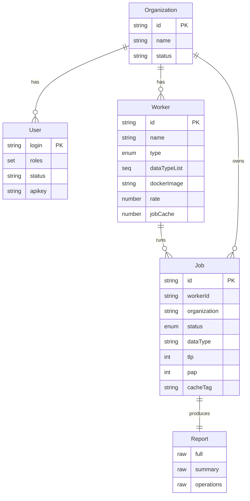
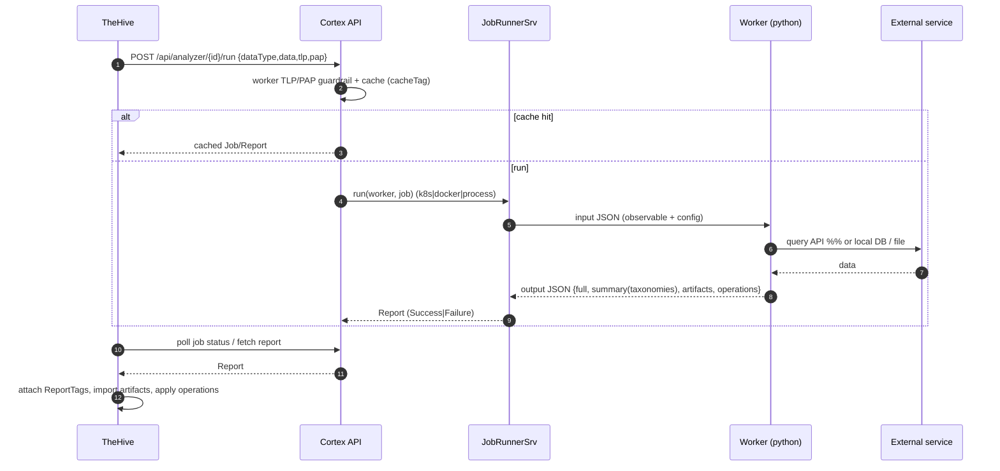

# Cortex — Analysis & Response Engine

> What Cortex does, how it runs analyzers/responders, its data model, and how it
> plugs into TheHive. Based on a read of
> [`TheHive-Project/Cortex`](https://github.com/TheHive-Project/Cortex) (v4.0.1)
> and [`TheHive-Project/cortex-analyzers`](https://github.com/TheHive-Project/cortex-analyzers)
> (155 analyzers, 48 responders at time of writing).

## What it is

Cortex answers one question: *how do you analyze observables (IPs, domains, URLs,
hashes, files, emails…) at scale through a single API instead of logging into 30
services by hand?* TheHive calls Cortex; so can MISP and your own scripts.

It does two things, modeled as the two `WorkerType` values:

| Type | Purpose | Example |
|---|---|---|
| **Analyzer** | Enrich / investigate an observable | Hash → VirusTotal, IP → AbuseIPDB, file → sandbox |
| **Responder** | Take an action in response to an entity | Block an IP, send mail, push an IOC to a firewall |

## Architecture

- **Stateless Scala/Play REST API**, horizontally scalable.
- **Storage = Elasticsearch** (via the `elastic4play` library) — *not* a graph DB.
  Contrast with TheHive's JanusGraph.
- **Analyzers/responders are external programs** (mostly Python), shipped in a
  separate repo, launched as jobs. This is why you can write one in any language.

## Workers

A `Worker` (`models/Worker.scala`) is a configured instance of an analyzer or
responder definition. Key attributes: `name`, `type` (analyzer|responder),
`dataTypeList` (which observable types it accepts), `configuration` (secrets,
sensitive), `dockerImage`/`command`, `rate`/`rateUnit` (API quota limiting),
`jobCache`, `jobTimeout`. A worker belongs to an `Organization`.

## How a job runs (the execution mechanism)

`JobRunnerSrv.run(worker, job)` picks a runner based on the `job.runners` config
(an ordered preference) and what the worker provides:

```
runners preference:  kubernetes → docker → process
  k8s/docker:  needs worker.dockerImage
  process:     needs worker.command (local script)
```

There are three runners (`services/`): `K8sJobRunnerSrv`, `DockerJobRunnerSrv`,
`ProcessJobRunnerSrv`. Analyzers and responders run on separate Akka dispatchers
(`analyzer` / `responder` execution contexts).

**The I/O contract** (the `cortexutils` base class on the Python side):
- Cortex writes a JSON **input** (the observable + config) into a job work folder
  / stdin: `{ "dataType":"ip", "data":"1.2.3.4", "tlp":2, "pap":2, "config":{…} }`
- The worker subclasses `Analyzer`/`Responder`, reads it via `self.data_type`,
  `self.get_data()`, `self.get_param("config.key")`, does its work in `run()`,
  and emits a JSON **output** via:
  - `self.report({...})` → the full report
  - `self.summary(raw)` → **taxonomies** (`build_taxonomy(level, namespace, predicate, value)`,
    level ∈ info|safe|suspicious|malicious) — the coloured verdict badges
  - `self.artifacts(raw)` → **new observables** to pivot on (`build_artifact`)
  - `self.operations(raw)` *(responders/analyzers)* → **actions to apply back in
    TheHive** (add tag, create task, add log, add artifact, assign case…)
  - failure paths: `self.error()` / `self.notSupported()` / `self.unexpectedError()`

## Job lifecycle & Report

`Job` (`models/Job.scala`) status: `Waiting → InProgress → Success | Failure`
(+ `Deleted` soft-delete). A job records the worker, `dataType`/`data` (or
`attachment`), `tlp`/`pap` (default 2 = AMBER), `parameters`, timing, `cacheTag`.

`Report` (`models/Report.scala`) is a child of Job with three raw fields:
- `full` — the complete report JSON
- `summary` — the taxonomies
- `operations` — **update operations applied at the end of the job** (this is the
  channel by which an analyzer/responder report mutates TheHive)

## Guardrails & efficiency

- **TLP/PAP gating** — each worker config has `check_tlp` / `max_tlp` and
  `check_pap` / `max_pap`. The worker/cortexutils contract refuses execution
  when the input exceeds those limits, so a `TLP:RED` indicator should not leak
  to a third-party API. A rewrite should choose and test the enforcement point:
  before calling external Cortex, inside an embedded worker runner, or both.
  (AbuseIPDB ships `check_tlp:true, max_tlp:2`.)
- **Caching** — identical jobs are deduplicated via a `cacheTag` hash + `jobCache`
  TTL, so paid APIs aren't re-queried for the same hash.
- **Rate limiting** — per-worker `rate`/`rateUnit` respects third-party quotas.

## External vs local (does it phone home?)

Most analyzers call external APIs (need keys); a meaningful subset run fully
locally. Concrete examples I read:

| Worker | Network? | Mechanism |
|---|---|---|
| **AbuseIPDB** (analyzer) | External API | `requests.get("https://api.abuseipdb.com/api/v2/check", headers={"Key":api_key})` |
| **MaxMind GeoIP** (analyzer) | **None** | reads a bundled `GeoLite2-City.mmdb` file — nothing leaves the host |
| **Mailer** (responder) | SMTP out | accepts `thehive:case`/`thehive:alert`/`thehive:case_task`, sends an email |

Three buckets overall: **threat-intel lookups** (VirusTotal, Shodan, Censys,
AbuseIPDB, passive DNS…), **file analysis/sandboxing** (Cuckoo/AnyRun external;
Yara/Capa/ClamAV/FileInfo local), and **local utilities** (MaxMind, CyberChef).

## Multi-tenancy & access

`Organization` → `User` (roles: `read`, `analyze`, `orgadmin`, `superadmin`) →
API-key auth (`KeyAuthSrv`), plus LDAP/OAuth2. Each org has its own workers,
configs, and jobs.

## Cortex data model (Elasticsearch documents)



## How it connects to TheHive

This closes the loop with TheHive's Cortex connector (the `Job` / `Action` /
`AnalyzerTemplate` vertices in [`thehive-data-model.md`](./thehive-data-model.md)):

1. An analyst hits "analyze" on an observable in TheHive.
2. TheHive's `CortexClient` creates a **Job** on a configured Cortex server
   (`cortex { servers:[{url, auth:{type:bearer, key}}] }`).
3. Cortex runs the analyzer (process/docker/k8s) and returns a Report.
4. TheHive polls (`CortexActor`), stores its own `Job` vertex linked to the
   observable, attaches the report's taxonomies as **`ReportTag`** (the coloured
   badges), and imports extracted artifacts as new observables.
5. The report's **`operations`** are applied via `ActionOperation`s — e.g. mark
   the observable as IOC, add tags, create a task. Responders are the **`Action`**
   side, acting on any TheHive entity. The Cortex connector even exposes
   `RunAnalyzer` / `RunResponder` as TheHive notification *notifiers*, so analysis
   can be triggered automatically on events.

TheHive 4's connector supports these operation types:

| Operation | Effect in TheHive |
|---|---|
| `AddTagToCase` | Add a tag to the related case |
| `AddTagToArtifact` | Add a tag to the observable/artifact |
| `AddTagToAlert` | Add a tag to an alert |
| `CreateTask` | Create a task in the related case |
| `AddCustomFields` | Set or create a custom-field value on the related case |
| `CloseTask` | Mark the related task completed |
| `MarkAlertAsRead` | Mark an alert read |
| `AddLogToTask` | Add a task log |
| `AddArtifactToCase` | Create a new observable in the related case |
| `AssignCase` | Assign the related case to a user |

Rewrite rule: treat Cortex operations as trusted background writes, but route
them through the same domain services, permission/tenant checks, audit/outbox,
and stream/notification fan-out as user-initiated writes.

## Job-run sequence (TheHive → Cortex → worker)


