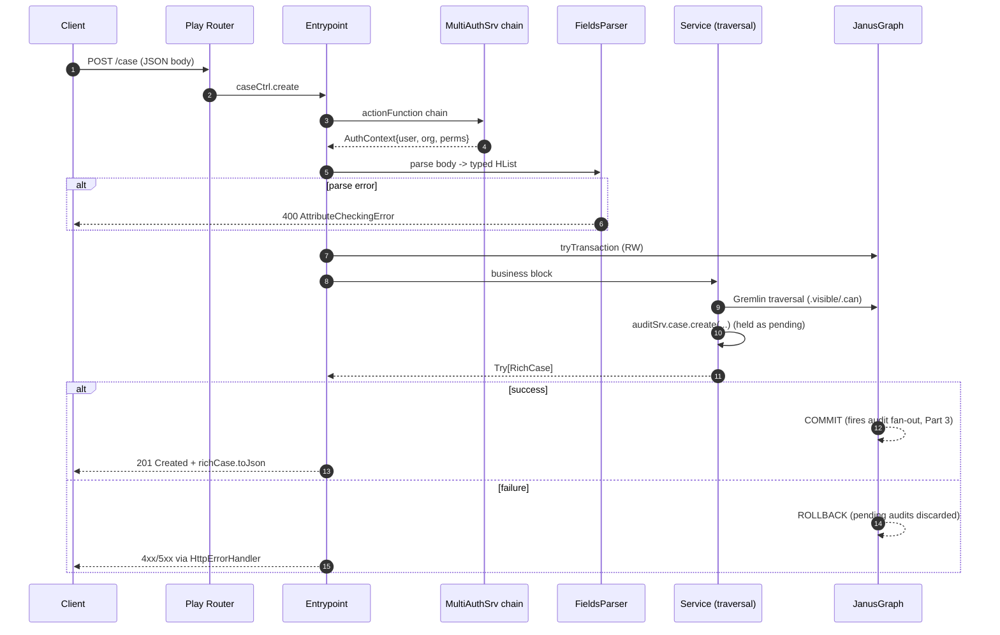

# TheHive 4 — API Implementation & Internal Mechanism

> Source-grounded walkthrough of how TheHive's HTTP API works, from route to
> graph and back, plus the write path (audit trail + live stream + notifications).
> Based on a read of [`TheHive-Project/TheHive`](https://github.com/TheHive-Project/TheHive)
> `controllers/v1` + services, and the [`ScalliGraph`](https://github.com/TheHive-Project/ScalliGraph)
> framework. Companion: [`thehive4-parity-spec.md`](./thehive4-parity-spec.md).

## Layering

```
Play Framework (HTTP, routing, actions)
  └─ ScalliGraph (Entrypoint, FieldsParser, Query DSL, Auth, Traversal, ORM, Schema)
       └─ Apache TinkerPop / Gremlin
            └─ JanusGraph (BerkeleyDB|Cassandra  +  Lucene|Elasticsearch index)
```

Two parallel API versions ship side-by-side: `v0` (legacy) and `v1`, each with
its own controllers, `Router`, and `QueryExecutor`.

---

# Part 1 — The read path (request lifecycle)

## 1. Routing — plain pattern matching
`controllers/v1/Router.scala` is a Play `SimpleRouter` using `sird`:

```scala
case POST(p"/case")                 => caseCtrl.create
case GET (p"/case/$caseId")         => caseCtrl.get(caseId)
case PATCH(p"/case/$caseId")        => caseCtrl.update(caseId)
case POST(p"/case/_merge/$caseIds") => caseCtrl.merge(caseIds)
```

Only single-entity CRUD + actions are routed here. **Listing/search/stats go
through one generic `/query` endpoint** (Part 2).

## 2. The `Entrypoint` — composable action builder
Every endpoint is assembled by an injected `Entrypoint` (ScalliGraph). It chains
*name → input parsing → auth/permission → transaction → business block*:

```scala
def create: Action[AnyContent] =
  entrypoint("create case")
    .extract("case",  FieldsParser[InputCase])
    .extract("tasks", FieldsParser[InputTask].sequence.on("tasks"))
    .authTransaction(db) { implicit request => implicit graph =>
      val inputCase: InputCase = request.body("case")   // statically typed
      for {
        organisation <- userSrv.current.organisations(Permissions.manageCase).get(request.organisation).getOrFail("Organisation")
        user         <- inputCase.user.fold(userSrv.current.getOrFail("User"))(userSrv.getByName(_).getOrFail("User"))
        richCase     <- caseSrv.create(inputCase.toCase, Some(user), organisation, …)
      } yield Results.Created(richCase.toJson)
    }
```

- **`.extract(name, parser)`** appends a typed field to a **shapeless `HList`**;
  the body type accumulates at *compile time*, so `request.body("case")` is
  typed `InputCase`.
- The terminal combinator selects cross-cutting behaviour. The matrix:
  `auth` / `authPermitted(perm)` / `authTransaction` / `authPermittedTransaction`
  / `authRoTransaction` / `asyncAuth` — i.e. {authenticated?} × {permission?} ×
  {read-only | read-write | none} × {sync | async}. That's why controller
  methods are ~6 lines.

## 3. Authentication — a chain of `ActionFunction`s
`authSrv` is a **`MultiAuthSrv`**: an ordered provider list
(`session, basic, key, pki, header, ldap, ad, oauth2`). Each implements
`actionFunction`; if it can't authenticate, it **delegates to the next**:

```scala
override def actionFunction(next) = new ActionFunction {
  def invokeBlock(request, block) =
    getAuthContext(request)
      .fold(next.invokeBlock(request, block)) { authContext =>   // not me → next
        block(new AuthenticatedRequest(authContext, request))
      }
}
```

Output is an **`AuthContext`** = `{ userId, current organisation, permissions }`.
The org is resolved by `RequestOrganisation` from a configurable
header/param/path/cookie — that's how a multi-org user "acts as" one org.
Permission gates are just `request.isPermitted(permission)`.

## 4. `FieldsParser` — declarative, error-accumulating input
`FieldsParser[T]` turns the request into a typed `T`, collecting **all**
validation errors (`Or[T, Every[AttributeError]]`). Combinators: `.optional`,
`.sequence`, `.on("path")`; `FieldsParser[InputCase]` is macro-derived.
Failures become a structured `400`. Updates use
`FieldsParser.update("case", publicProperties)` → a list of validated
`PropertyUpdater`s.

## 5. `PublicProperties` — the field registry
Declared once per entity (`controllers/v1/Properties.scala`):

```scala
PublicPropertyListBuilder[Case]
  .property("title",    UMapping.string)(_.field.updatable)
  .property("number",   UMapping.int)(_.field.readonly)
  .property("assignee", UMapping.string.optional)(_.field.custom { … caseSrv.assign … })
  .property("tags",     UMapping.string.set)(_.field.custom { … caseSrv.updateTags … })
  .build
```

Each entry binds **JSON name → graph mapping → behaviour** (`readonly` /
`updatable` / `custom`). `custom` runs service logic (e.g. `assignee` rewrites
the `CaseUser` edge). This single registry powers **filter, sort, aggregation,
update, and the `/describe`** endpoint (which serialises it so the UI auto-builds
search forms).

## 6. Traversals + multi-tenancy
Business logic is expressed as Gremlin traversals (`TraversalOps`). The tenancy
guard is two steps applied everywhere (`services/CaseSrv.scala`):

```scala
def visible(orgSrv)(implicit auth) =
  traversal.has(_.organisationIds, orgSrv.currentId(graph, auth))         // org scoping

def can(permission)(implicit auth) =
  if (auth.permissions.contains(permission))
    traversal.filter(_.share.profile.has(_.permissions, permission))      // share→profile→perm
  else traversal.empty
```

Because `visible`/`can` are baked into `initialQuery`, `getQuery`, and service
lookups, **org isolation is enforced at the data-access layer** — a query
physically cannot return another org's data.

## 7. Transaction & output
The terminal wraps the block in `db.tryTransaction` (RW) or `db.roTransaction`
(RO); the `Try` decides commit/rollback. Single objects → `Results.Ok(x.toJson)`.
Lists are **chunked-streamed** (see Part 2).

---

# Part 2 — The `/query` DSL (search / list / navigate / stats)

The client POSTs an **array of named operations** that is type-checked and
compiled into one streamed traversal:

```json
[ {"_name":"listCase"},
  {"_name":"filter","_and":[{"_field":"status","_value":"Open"},{"_gt":{"severity":2}}]},
  {"_name":"sort","_fields":[{"startDate":"desc"}]},
  {"_name":"page","from":0,"to":10,"extraData":["total"]} ]
```

- **Each step is a `Query`** ≈ a typed `(input, fromType, graph, authContext) => output`
  with reflection methods `checkFrom(type)` / `toType(type)`.
- **Composition is type-checked at runtime via Scala reflection.**
  `QueryExecutor.parser` reads `listCase` (→ `Traversal.V[Case]`), then for each
  next op finds a registered `Query` whose name matches **and** whose `checkFrom`
  accepts the previous output type, and chains via `query.andThen(q)`. So
  `observables` is only valid after a step that yields cases.
- **Step registry** (`TheHiveQueryExecutor`): gathers every controller's
  `initialQuery` (`listCase`…), `getQuery` (`getCase`…), `pageQuery` (`page`),
  `outputQuery`, and `extraQueries` (`observables`, `tasks`, `shares`,
  `linkedCases`, `countCase`…), then **auto-appends** the generic `sort`,
  `filter`, `aggregation`, `count`, `limitedCount` — all wired to
  `publicProperties`. `listCase` itself = `caseSrv.startTraversal(graph).visible(org)`,
  so tenancy is in the entry step.
- **Executors compose** (`++`): the Cortex connector's `CortexQueryExecutor` is
  merged in, so its query steps appear seamlessly.
- **Rendering & streaming** (`QueryExecutor.execute`): a `Renderer` is chosen by
  output type (reflection). Lists stream via `db.source[JsValue]` +
  `intersperse("[",",","]")` (chunked JSON array); the total (when
  `extraData:["total"]`) returns as an **`X-Total` header**. Counts above
  `query.limitedCountThreshold` short-circuit to avoid full scans.

## Read-path sequence



---

# Part 3 — The write path: audit trail → commit → live stream + notifications

TheHive never writes audit rows inline or pushes to clients directly. It uses
**deferred, transaction-coupled audit batching** with **publish-strictly-on-commit**
to an Akka event bus, and clients **long-poll** per-session stream actors that
re-filter by visibility.

## 3.1 Audits are *held*, and only the last is the "main action"
A mutation calls a typed audit helper (`services/AuditSrv.scala`):
- `SelfContextObjectAudit[E]` — entity is its own context (Case, Task, Observable, Dashboard, Organisation, Profile, Pattern, CustomField, Page).
- `ObjectAudit[E, C]` — audited within another context (Log in Task, Procedure in Case, Observable in Alert).
- Bespoke: `ShareAudit`, `AlertAudit`, `UserAudit` (shareCase, createCase, changeProfile…).

`auditSrv.create(audit, context, object)` does **not** write immediately:

```scala
// store this as the pending audit for this transaction,
// and flush the PREVIOUS pending one to the DB
val p = pendingAudits.get(graph)
pendingAudits += (graph -> PendingAudit(audit, context, object))
p.fold(setupCallbacks())(prev => createFromPending(prev.audit, prev.context, prev.object))
```

So in a request that creates a case + 3 tasks + 2 custom fields, the
intermediate audits are written as secondary, and the **last** one is flagged
`mainAction = true` at flush — that single record represents the user-facing
operation and drives the activity flow. (`mergeAudits` can disable auditing for a
sub-transaction entirely.)

## 3.2 Writing an audit = vertex + three edges
`createFromPending` persists the `Audit` vertex and links it:
- `AuditUser` → acting user
- `Audited` → the object (polymorphic edge → any vertex)
- `AuditContext` → the context (e.g. owning Case; wrapped in try since on delete the context may be gone)

and records the new audit id in `transactionAuditIds` for this graph.

## 3.3 Fan-out happens **only on COMMIT**
`flushPendingAudit` runs as a DB callback at end of transaction; it flushes the
final main-action audit then registers a transaction listener:

```scala
db.addTransactionListener {
  case Status.COMMIT =>
    eventSrv.publish(StreamTopic.dispatcher)(AuditStreamMessage(auditIds: _*)) // → stream bus
    notificationActor ! AuditNotificationMessage(auditIds: _*)                 // → triggers/notifiers
  case _ =>  // ROLLBACK: pending audits + ids already discarded
}
```

Nothing is published if the transaction rolls back → **stream events and
notifications are exactly consistent with committed data.** The two subscribers
are decoupled via the Akka bus (works across a cluster via distributed pub-sub):
- **Notification actor** evaluates triggers (CaseCreated, AlertCreated, TaskAssigned, JobFinished, LogInMyTask, CaseShared, AnyEvent) → notifiers (Emailer, Webhook, Mattermost, AppendToFile, RunAnalyzer, RunResponder).
- **Stream dispatcher** delivers to UIs (below).

## 3.4 Live delivery — per-session actors + long polling + 2nd visibility gate
- On UI load, `StreamSrv.create` mints a random `streamId`, spawns a
  **per-session `StreamActor`** (holding that user's `AuthContext` + org), and
  subscribes it to the global `"stream"` topic and its own `stream-<id>` topic.
- Every `AuditStreamMessage` hits the actor, which **re-checks visibility** —
  the second tenancy gate:

  ```scala
  val visibleIds = auditSrv.getByIds(ids).visible(organisationSrv)(authContext).toSeq.map(_._id)
  ```

  `AuditOps.visible` branches on the context object's label and reuses each
  entity's own `.visible` (Case/Observable/Task/Alert/Org/CaseTemplate/Dashboard/Share),
  so a user only ever receives ids for objects their org can see.
- The client polls `GET /stream/<id>`. The actor does **long polling with
  coalescing**: holds the request open (`refresh`), and when messages arrive
  waits a short `graceDuration` to batch bursts, then `Commit`s the accumulated
  ids back (bounded by `maxWait`). An idle `keepAlive` timer PoisonPills the
  actor. The client gets the changed audit ids and refreshes the affected views.
- The persistent equivalent is the **activity flow** (`auditCtrl.flow` →
  `AuditSrv.getMainByIds`): a visibility-filtered query over `mainAction = true`
  audits sorted by date.

## Write-path / stream sequence

```mermaid
sequenceDiagram
    autonumber
    participant Tx as Service Tx (writer)
    participant AS as AuditSrv
    participant DB as JanusGraph
    participant BUS as Akka EventSrv bus
    participant NA as Notification actor
    participant SA as StreamActor (per session)
    participant UI as Browser (long poll)

    Tx->>AS: audit.create/update (x N in one tx)
    AS->>AS: hold pending; flush previous as secondary
    Tx->>DB: commit transaction
    AS->>DB: write final audit (mainAction=true) + AuditUser/Audited/AuditContext
    DB-->>BUS: on COMMIT: publish AuditStreamMessage(ids)
    DB-->>NA: on COMMIT: AuditNotificationMessage(ids)
    NA->>NA: match triggers -> run notifiers (email/webhook/responder)
    BUS-->>SA: AuditStreamMessage(ids)
    SA->>DB: getByIds(ids).visible(org, auth)   %% 2nd visibility gate
    SA->>SA: batch within graceDuration
    UI->>SA: GET /stream/{id} (held open)
    SA-->>UI: changed audit ids
    UI->>UI: refresh affected views
```

---

# Reimplementation notes

- **Hardest to port:** the reflection-based **type-checking of the query
  pipeline** (`checkFrom`/`toType` over `ru.Type`). In a language without rich
  runtime types, replace with explicit per-step input/output type tags or a
  hand-written grammar.
- **The linchpin abstraction is `PublicProperties`** — filter, sort, aggregation,
  update, and `describe` all derive from it. Build that and the generic API
  mostly falls out.
- **Audit/stream consistency comes from publishing on the commit hook**, not from
  the service call. Any rewrite should bind event emission to the transaction
  outcome, not to the business method, or you'll leak phantom events on rollback.
- In a PostgreSQL rewrite, use a **durable outbox** written in the same
  transaction as the audit rows, then dispatch stream/notification/connector
  work after commit with retry and idempotency. That is the relational
  equivalent of the JanusGraph transaction listener.
- **Two visibility gates**: at write time (context edge) and at delivery
  (per-session re-filter). Don't rely on only one.
- **Long polling is source behavior, not a rewrite requirement**. TheHive uses
  per-session actors + distributed pub-sub; a rewrite can use SSE, WebSockets,
  or long polling if it preserves per-user/org visibility rechecks and
  commit-coupled delivery.
```

A read mutates nothing; a write fans out to the audit trail, the activity flow,
the live stream, and the notification engine — all gated on transaction commit.
