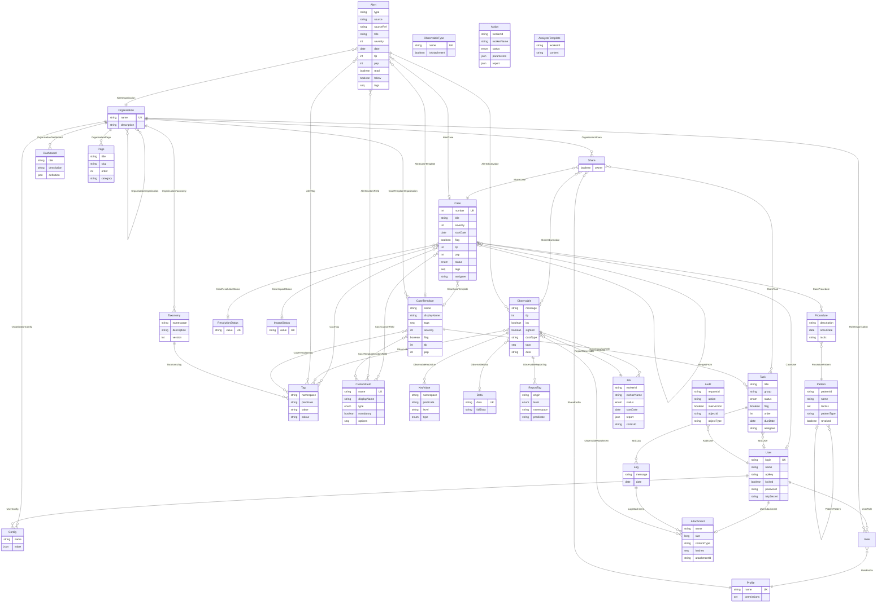
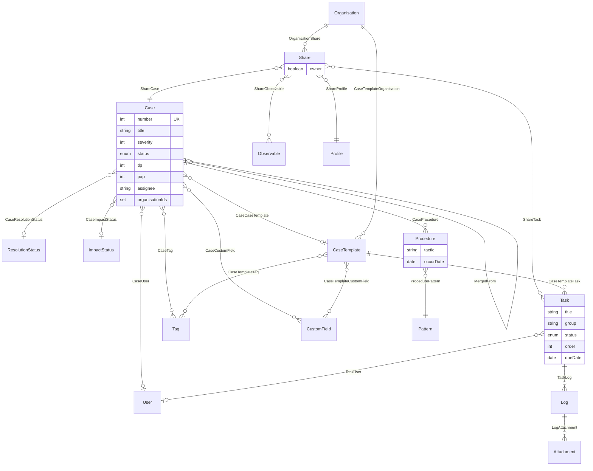
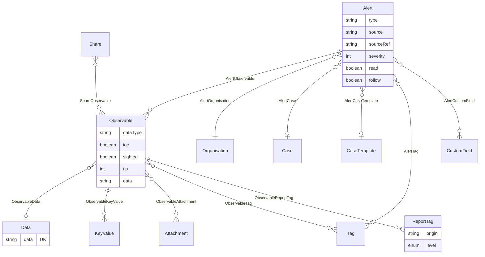
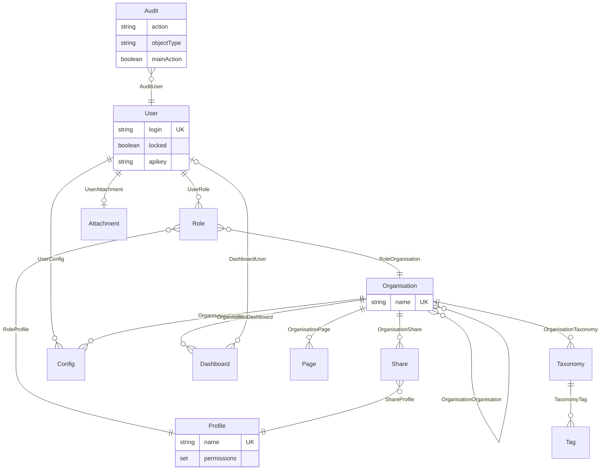
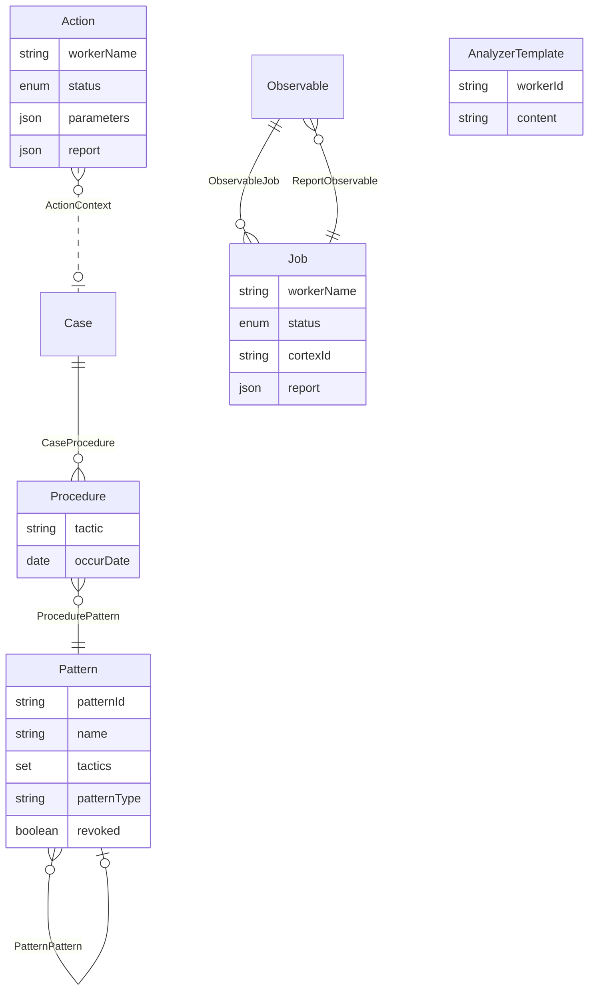

# TheHive — Database / Data Model

> Reverse-engineered from the [`TheHive-Project/TheHive`](https://github.com/TheHive-Project/TheHive)
> Scala source (v4/v5 architecture), from the domain model under
> `thehive/app/org/thp/thehive/models/` and the Cortex connector under
> `cortex/connector/src/main/scala/org/thp/thehive/connector/cortex/models/`.

## TL;DR — it's a graph, not relational

TheHive does **not** use a relational database. It runs on a **graph database
(JanusGraph)** through an in-house abstraction layer called **ScalliGraph**.
So there are no tables or foreign keys — there are:

- **Vertices** = entities, declared with `@BuildVertexEntity`
- **Edges** = relationships, declared with `@BuildEdgeEntity[From, To]`

Indexes are declared inline on the entities with `@DefineIndex(...)` and are
backed by Lucene / Elasticsearch. Binary attachments are **not** stored in the
graph — only metadata + hashes are; the bytes live in an external store
(local FS / HDFS / S3) keyed by `attachmentId`.

Every vertex also carries ScalliGraph metadata properties: `_id`, `_label`,
`_createdBy`, `_createdAt`, `_updatedBy`, `_updatedAt`.

---

## Full model

---

## Per-domain diagrams

### 1. Case & collaboration

A `Case` is the central investigation object. It is made visible to an
`Organisation` only through a `Share`, which also bundles its `Task`s and
`Observable`s and pins a `Profile` (permission level) for that share.

### 2. Alerts & observable enrichment

An `Alert` is an inbound event (unique on `type`+`source`+`sourceRef`+org). It
can be promoted into a `Case`, carrying its `Observable`s with it. Observable
values are deduplicated into `Data` vertices; analyzer verdicts attach as
`ReportTag`.

### 3. RBAC & multi-tenancy

A `User` has one `Role` per `Organisation`; a `Role` binds the user to a
`Profile` (the named permission set) within that org. `OrganisationOrganisation`
links orgs together (e.g. for cross-org sharing).

### 4. MITRE ATT&CK & Cortex

ATT&CK techniques are `Pattern` vertices (self-linked into a tactic/technique
hierarchy via `PatternPattern`), tied to a `Case` through a `Procedure`. The
Cortex connector adds `Job` (analyzer runs on observables) and `Action`
(responder runs on any entity, via the polymorphic `ActionContext` edge).

---

## Vertices (entities)

| Vertex | Purpose | Notable / unique fields |
|---|---|---|
| **Organisation** | Tenant boundary (multi-tenancy) | `name` (unique) |
| **User** | Account | `login` (unique), `apikey`, `password`, `totpSecret`, `locked` |
| **Role** | Join object binding a User → Profile within an Org | *(no own fields)* |
| **Profile** | Named permission set | `name` (unique), `permissions` |
| **Case** | Investigation case | `number` (unique), `severity`, `tlp`, `pap`, `status`, `tags`, `assignee` |
| **Task** | Work item within a case | `group`, `status`, `order`, `dueDate`, `assignee` |
| **Log** | Task log entry | `message`, `date` |
| **Observable** | IOC / artifact | `dataType`, `ioc`, `sighted`, `tlp`, `data` |
| **Data** | Deduplicated observable value | `data` (unique) — hashed if oversized |
| **Alert** | Inbound event before promotion to a case | unique (`type`,`source`,`sourceRef`,`organisationId`); `read`, `follow` |
| **CaseTemplate** | Template for cases | `name`; tasks/customFields via edges |
| **CustomField** | Custom-field definition | `name` (unique), `type` ∈ {string,integer,float,boolean,date} |
| **Tag** | Tag / taxonomy tag | unique (`namespace`,`predicate`,`value`), `colour` |
| **Attachment** | File metadata (bytes live externally) | `hashes`, `attachmentId` |
| **Share** | Grants an Org access to a Case (+ tasks/observables) | `owner` |
| **Audit** | Audit-trail event | `action` (create/update/delete/merge), `objectId`, `objectType` |
| **Dashboard** | Dashboard definition | `definition` (JSON) |
| **Page** | Org knowledge-base page | `slug`, `category`, `order` |
| **Procedure** | ATT&CK procedure occurrence on a case | `tactic`, `occurDate` |
| **Pattern** | MITRE ATT&CK technique/tactic | `patternId`, `tactics`, `capecId`; self-referential parent |
| **Taxonomy** | MISP-style taxonomy | `namespace`, `version` |
| **KeyValue** | Extra typed key/values on observables | `type` ∈ ValueType |
| **ReportTag** | Tag produced by a Cortex analyzer report | `level` ∈ {info,safe,suspicious,malicious} |
| **ObservableType** | Allowed observable datatypes | `name` (unique), `isAttachment` |
| **Config** | Org-level / user-level config | `name`, `value` (JSON) |
| **ResolutionStatus / ImpactStatus** | Case status lookups | `value` (unique) |
| **Job** *(Cortex)* | Analyzer run on an observable | `status`, `cortexId`, `report` |
| **Action** *(Cortex)* | Responder run on any entity | `status`, `parameters`, `report` |
| **AnalyzerTemplate** *(Cortex)* | Cached analyzer report template | `workerId`, `content` |

## Edges (relationships)

Most edges are plain directed links. A few carry properties:

- **Custom-field-value edges** (`CaseCustomField`, `AlertCustomField`,
  `CaseTemplateCustomField`) hold `order` + one of
  `stringValue` / `booleanValue` / `integerValue` / `floatValue` / `dateValue`.
- `ShareTask` carries `actionRequired`; `OrganisationDashboard` carries `writable`.
- Self-referential: `MergedFrom` (Case→Case), `PatternPattern` (Pattern→parent),
  `OrganisationOrganisation` (org→org links).

**Polymorphic edges** (hand-written `EdgeModel`s whose target is *any* vertex,
so they are omitted from the typed diagrams above):

| Edge | From | To |
|---|---|---|
| **Audited** | Audit | the audited object (any vertex) |
| **AuditContext** | Audit | the visibility context (e.g. owning Case) |
| **ActionContext** | Action | the entity a responder acted on (any vertex) |

---

## Permissions reference

A `Profile` is a named set of these permissions (`models/Permissions.scala`).
Each permission has a **scope**: `organisation` permissions can be granted to any
org's profiles; `admin`-scoped permissions are **only effective in the admin
organisation** and are stripped from ordinary orgs (`restrictedPermissions`).

| Permission | Scope | Governs |
|---|---|---|
| `manageCase` | organisation | create/update/delete cases |
| `manageObservable` | organisation | observables/IOCs |
| `manageAlert` | organisation | alerts + promote-to-case |
| `manageTask` | organisation | tasks + logs |
| `manageShare` | organisation | share/unshare a case with orgs |
| `manageProcedure` | organisation | ATT&CK procedures on cases |
| `managePage` | organisation | org knowledge-base pages |
| `manageTag` | organisation | tags |
| `manageCaseTemplate` | organisation | case/task templates |
| `manageAnalyse` | organisation | run Cortex **analyzers** |
| `manageAction` | organisation | run Cortex **responders** |
| `accessTheHiveFS` | organisation | the TheHiveFS/WebDAV attachment mount |
| `manageUser` | organisation, admin | users (org-scoped, broader in admin org) |
| `manageConfig` | organisation, admin | org-level + platform config |
| `manageOrganisation` | admin | create/manage organisations |
| `manageProfile` | admin | permission profiles |
| `manageCustomField` | admin | custom-field definitions |
| `manageObservableTemplate` | admin | observable types |
| `manageTaxonomy` | admin | taxonomies |
| `managePattern` | admin | MITRE ATT&CK pattern catalog |
| `manageAnalyzerTemplate` | admin | Cortex report templates |
| `managePlatform` | admin | platform-wide administration |

**Built-in profiles** (`Profile.initialValues`): `admin` (all admin-scope perms),
`org-admin` (all organisation-scope perms), `analyst` (manage case/observable/
alert/task/action/share/analyse/page/procedure + accessTheHiveFS), and
`read-only` (no permissions).

## Enumerations reference

| Enum | Values | Used by |
|---|---|---|
| `CaseStatus` | `Open`, `Resolved`, `Duplicated` | `Case.status` |
| `TaskStatus` | `Waiting`, `InProgress`, `Completed`, `Cancel` | `Task.status` |
| `CustomFieldType` | `string`, `integer`, `float`, `boolean`, `date` | `CustomField.type` |
| `ValueType` | `string`, `integer`, `float`, `boolean`, `date` | `KeyValue.type` |
| `ReportTagLevel` | `info`, `safe`, `suspicious`, `malicious` | `ReportTag.level` (Cortex verdicts) |
| `JobStatus` (Cortex) | `InProgress`, `Success`, `Failure`, `Waiting`, `Deleted` | `Job.status`, `Action.status` |

**TLP** (`tlp`) and **PAP** (`pap`) are integers `0..3` = WHITE / GREEN / AMBER /
RED, default `2` (AMBER). **Severity** is `1..4` (low/medium/high/critical).

**`ObservableType.initialValues`** (the seeded datatypes; `isAttachment=true` only
for `file`): `url`, `domain`, `fqdn`, `hostname`, `ip`, `mail`, `mail-subject`,
`hash`, `filename`, `file`, `registry`, `regexp`, `uri_path`, `user-agent`,
`autonomous-system`, `other`.

---

## Things worth knowing when reading/querying the model

- **Multi-tenancy is enforced by graph traversal.** Visibility of a `Case` =
  "is there a `Share` path from your `Organisation` to it?" Several vertices
  also denormalize `organisationIds` / `relatedId` as **indexed properties**
  purely to speed up those traversals.
- **Denormalized fields shadow edges.** `Case.assignee` / `impactStatus` /
  `resolutionStatus`, `Observable.data`, `Alert.caseId`, etc. are
  "filled by the service" copies of edge targets, kept for indexing. The edges
  (`CaseUser`, `ObservableData`, `AlertCase`, …) are the source of truth.
- **Attachments/blobs are not in the graph** — `Attachment.attachmentId`
  references an external object store; the graph keeps only metadata + hashes.
- **MITRE ATT&CK** is modeled as `Pattern` (self-linked hierarchy) linked to
  cases through `Procedure`.
- **Cortex** (analyzers/responders) lives in a separate connector module:
  `Job`, `Action`, `AnalyzerTemplate`.
