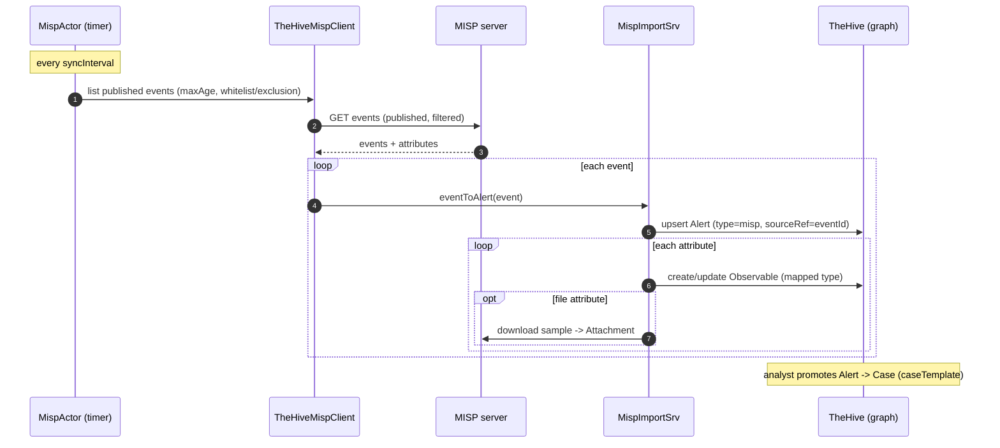

# MISP Connector — Deep Dive

> How TheHive synchronizes with [MISP](https://www.misp-project.org/) (Malware
> Information Sharing Platform): scheduled import of events as alerts, export of
> cases as events, and the filtering/mapping in between. Based on
> `misp/connector/.../services` in
> [`TheHive`](https://github.com/TheHive-Project/TheHive).
> Companion: [`thehive-data-model.md`](./thehive-data-model.md), [`cortex.md`](./cortex.md).

## What the connector does

MISP is a threat-intel sharing platform built around **Events** (containers) that
hold **Attributes** (IOCs). TheHive's MISP connector is **bidirectional**:

- **Import** (MISP → TheHive): periodically pull published MISP events and turn
  each into a TheHive **Alert**, with attributes becoming **Observables**.
- **Export** (TheHive → MISP): push a case's IOC observables to MISP as a new
  **Event** with **Attributes**.

It's enabled per-config with one or more servers:

```hocon
play.modules.enabled += org.thp.thehive.connector.misp.MispModule
misp {
  interval: 1 hour
  servers: [{ name="local", url="https://misp/", auth{ type=key, key="***" }, wsConfig{} }]
}
```

## Architecture & scheduling

- **`MispActor`** drives synchronization. On startup it schedules a `Synchro`
  message after `syncInitialDelay`, and after each run re-schedules after
  `syncInterval` (the configured `interval`). Each tick iterates every configured
  client and pulls events.
- **`TheHiveMispClient`** wraps one MISP server: REST calls (publish-filtered
  event search, attribute download, attachment download), plus its sync policy.
- **`MispImportSrv`** / **`MispExportSrv`** hold the mapping logic.
- **`Connector`** holds the attribute-type mapping (`misp.attribute.mapping`).
- Results stream via Akka Streams (`QueueIterator`, `Base64Flow` for attachments).

## Per-server sync policy (`TheHiveMispClientConfig`)

This is what makes the sync safe and selective:

| Setting | Effect |
|---|---|
| `purpose` | `ImportOnly` / `ExportOnly` / `ImportAndExport` |
| `caseTemplate` | template applied when an imported alert is promoted to a case |
| `maxAttributes` | skip events with too many attributes |
| `maxAge` | only sync recent events |
| `whitelist.organisations` / `exclusion.organisations` | which MISP orgs to include/skip |
| `whitelist.tags` / excluded tags | tag-based include/skip filtering |
| `exportCaseTags` | include case tags on the exported MISP event |
| `exportObservableTags` | include observable tags on exported attributes |

## Import: MISP Event → TheHive Alert

`MispImportSrv.eventToAlert` maps each event to an `Alert`:

```scala
Alert(
  `type`        = "misp",
  source        = mispOrganisation,                 // creating MISP org
  sourceRef     = event.id,                          // MISP event id  → dedup key
  externalLink  = Some(s"$mispUrl/events/${event.id}"),
  title         = s"#${event.id} ${event.info}",
  severity      = event.threatLevel … (4 - level),   // MISP 1..3  →  TheHive sev
  date          = event.date,
  lastSyncDate  = event.publishDate,                 // used for incremental sync
  tlp           = fromTags("tlp:white/green/amber/red" → 0/1/2/3),
  tags          = s"src:${event.orgc}" +: event.tags.map(_.name),
  organisationId = organisationId
)
```

Key mechanics:
- **Dedup / idempotency** rides on the Alert's natural key
  `(type, source, sourceRef, organisationId)` = `(misp, org, eventId, org)`. Re-syncing
  the same event updates the existing alert rather than duplicating it.
- **`lastSyncDate`** = the event's publish date, enabling incremental pulls.
- **TLP** is derived from the MISP `tlp:*` tags; **severity** is inverted from
  MISP's threat level.
- Each **MISP Attribute → TheHive Observable**, with the datatype resolved via
  `convertAttributeType(category, type)` against the configurable
  `misp.attribute.mapping` (falls back to a warning if unmapped). File attributes
  download the sample (`Base64Flow`) into an `Attachment`.
- The analyst then **promotes the alert to a case** (optionally via the
  configured `caseTemplate`) — same path as any other alert.

## Export: TheHive Case → MISP Event

`MispExportSrv.export(mispId, case)`:

1. `canExport(client)` — purpose/permission check.
2. `getAttributes` = the case's **IOC observables** (`observables.isIoc`),
   each mapped to a MISP `Attribute` via `observableToAttribute`
   (datatype → MISP category/type from the mapping; tags included iff
   `exportObservableTags`).
3. `removeDuplicateAttributes` — collapse repeats.
4. `createEvent` — create the MISP event (info from the case; case tags included
   iff `exportCaseTags`); if the case originated from a MISP alert it can
   **extend** that source event (`extendsEvent = alert.sourceRef`).
5. `createAlert` — write back a TheHive Alert referencing the new MISP event id,
   so the link is visible and re-import is deduplicated.

## Sync sequence



## Reimplementation notes

- **Idempotency is everything.** The `(type, source, sourceRef, org)` alert key +
  `lastSyncDate` are what make repeated polls safe and incremental. Get that
  uniqueness constraint right first.
- **The attribute↔observable type map is config, not code** — externalize it so
  ops can extend mappings without a release.
- **Filtering belongs at fetch time** (published-only, maxAge, org/tag
  whitelist) to avoid pulling the whole MISP instance every interval.
- **Export only IOC observables**, dedup them, and write back a linking alert so
  the round-trip doesn't loop.

## Scope / not in this connector

- **MISP sightings are not synchronized** — the connector imports events/attributes
  and exports IOC observables, but does not push/pull MISP sightings. (TheHive's
  own `Observable.sighted` flag is separate and local.) Add this explicitly if
  your intel-sharing workflow depends on sighting feedback.
- **No automatic alert→case promotion on import** — imported events land as
  alerts; an analyst (or a rule) promotes them, optionally via the configured
  `caseTemplate`.
