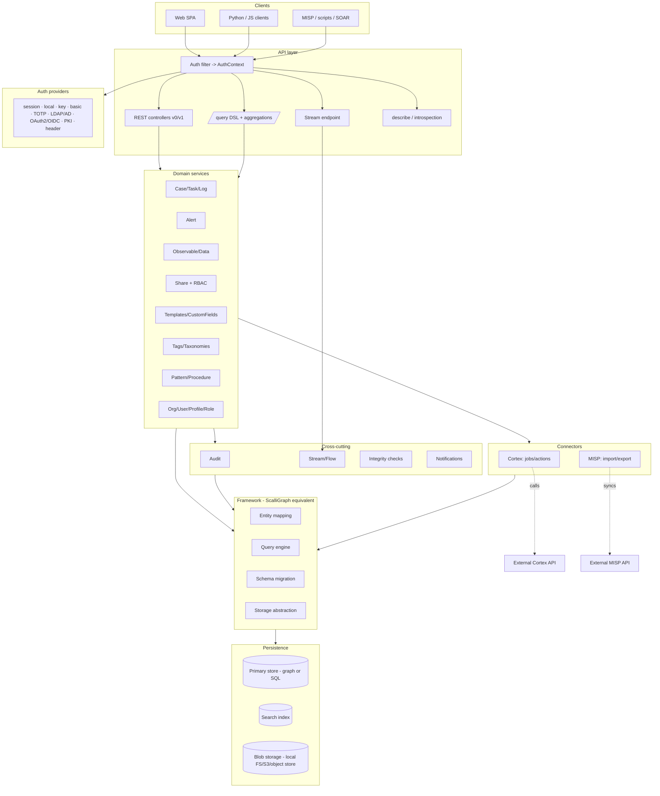
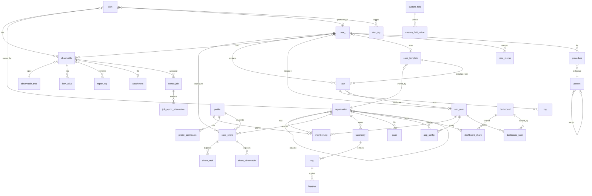

# TheHive 4 Rewrite — Parity Spec, Architecture & Relational Design

> Derived from a read of [`TheHive-Project/TheHive`](https://github.com/TheHive-Project/TheHive)
> (v4/v5, the `ScalliGraph` + JanusGraph architecture). This document is the
> "what you must build to be on par" checklist, a subsystem/component diagram,
> and a concrete **PostgreSQL-instead-of-JanusGraph** data model.
>
> Companion doc: [`thehive-data-model.md`](./thehive-data-model.md) (the original graph schema).

---

# Part A — Rewrite scope & feature checklist

> Rule of thumb: ~40% of the effort is the **foundation layer** (the bits that
> live in the `ScalliGraph` framework submodule, not the app), and the highest
> *correctness* risk is the **multi-tenant Share model** (§3).

## Rewrite target

This is a **source-informed rewrite plan**, not a mandate to clone every TheHive
4 wire shape. Treat upstream as the reference for mechanisms and edge cases, then
choose a smaller compatibility surface deliberately.

| Must preserve | Can simplify | Optional / drop unless required |
|---|---|---|
| Tenant isolation through organisations, memberships, Share rows, profile permissions, and data-layer enforcement | One clean API instead of v0+v1 compatibility | Drop-in compatibility with legacy clients |
| Case/task/log/observable/alert workflows, case numbering, tags, custom fields, templates, dashboards, audit trail | PostgreSQL joins/CTEs instead of Gremlin traversals | Exact ScalliGraph reflection-based type system |
| `/query`-style field registry that drives filter/sort/update/describe/aggregation | A new query grammar with equivalent semantics for the new UI | Exact upstream query JSON syntax if no legacy UI/client needs it |
| Commit-coupled audit, stream, notification, and connector mutations | Durable outbox + SSE/WebSocket instead of Akka actors/long polling | WebDAV/TheHiveFS and every blob-provider backend |
| Cortex/MISP writes going through normal services, permissions, audit, and tenant checks | Connectors as plugins with narrower initial worker/server support | Full Cortex/MISP UI parity in the first internal release |

## 0. Foundation / framework layer
- [ ] Entity ↔ storage mapping ("ORM"): typed properties, `Option`/`Seq`/`Set`, enums
- [ ] Composable **query contract** (filter, traverse/join, sort, paginate, aggregate); exact ScalliGraph syntax is optional
- [ ] Common entity metadata on every record: `_id`, `_createdBy`, `_createdAt`, `_updatedBy`, `_updatedAt`
- [ ] Index management: unique / standard / full-text declarations + provisioning
- [ ] **Schema definition + live migration framework** (idempotent, versioned, runs on startup)
- [ ] Request pipeline: field parsing, input validation, output rendering, error model
- [ ] Pluggable blob-storage abstraction
- [ ] Pluggable auth-provider chain

## 1. Data layer
- [ ] Primary datastore — single-node **and** clustered/HA variants
- [ ] Search/index backend (full-text + exact) — embedded **and** external (for cluster)
- [ ] All 30 source entities + source-critical relationships (see companion doc / Part C)
- [ ] Observable value **dedup** + hashing of oversized values
- [ ] Monotonic, concurrency-safe **case numbering**

## 2. Domain services (≈ one per entity)
- [ ] CaseSrv — CRUD, **merge**, close/reopen, custom fields, similar-cases, per-user permissions
- [ ] AlertSrv — dedup on `(type,source,sourceRef,org)`, **promote→case**, merge, read/follow, observable import
- [ ] ObservableSrv — IOC/sighted/similarity, dedup, data-vs-attachment, org visibility
- [ ] TaskSrv / LogSrv — lifecycle/status, ordering, assignment, logs + attachments
- [ ] ShareSrv — the multi-tenant engine (§3)
- [ ] CaseTemplateSrv + task templates — templated creation, custom-field defaults
- [ ] CustomFieldSrv — typed values, mandatory enforcement, ordering
- [ ] TagSrv — free vs namespaced/taxonomy tags, colours, auto-create
- [ ] User / Organisation / Profile / Role services — RBAC graph
- [ ] AuditSrv — audit trail on every mutation (§7)
- [ ] DashboardSrv — store JSON + run aggregation queries
- [ ] TaxonomySrv — import/enable/disable MISP taxonomies → tags
- [ ] PatternSrv / ProcedureSrv — MITRE ATT&CK import + case linkage
- [ ] PageSrv, ConfigSrv, and supporting srvs (Data, KeyValue, ReportTag, statuses, ObservableType, Attachment)

## 3. Multi-tenancy & RBAC (highest correctness risk)
- [ ] **Organisations** as hard tenant boundaries
- [ ] **Profiles** = named permission sets; enumerated **Permissions** (manageCase, manageObservable, manageAlert, manageTask, manageShare, manageAnalyse, managePage, manageProcedure, manageConfig, … + admin scope)
- [ ] **Roles** binding `User → Profile` **per Organisation** (multi-org membership)
- [ ] **Share model**: case visible to an org only via a Share that bundles tasks/observables + pins a profile; share/unshare; owning-org vs shared-org; `actionRequired`
- [ ] Share lifecycle semantics: share/unshare cases, add/remove task/observable shares, propagate visibility to child objects, delete orphaned child objects only when no remaining share can see them
- [ ] Org-to-org **links** governing who can share with whom
- [ ] **Visibility enforced inside every query** (Postgres RLS or equivalent) — airtight, not a post-filter
- [ ] RLS/policy matrix for every readable table: cases, tasks, logs, observables, alerts, tags, custom fields, dashboards, pages, audits, Cortex jobs/actions, exports

## 4. API layer
- [ ] REST CRUD + actions for every entity
- [ ] Default API surface: **one clean API**; add v0/v1 compatibility only if existing TheHive clients must work unchanged
- [ ] Generic **`/query`-style** endpoint — pipeline of ops (list/get/filter/sort/page/aggregation/traversal). A new UI can use a cleaner grammar, but the same field registry must drive it.
- [ ] **Aggregations** (count/sum/avg/time-series/multi-level group-by)
- [ ] Bulk ops, pagination, sorting, range headers
- [ ] API self-introspection (`describe`) for UI field/filter discovery
- [ ] Per-entity output renderers (computed/joined fields)
- [ ] Attachment up/download, export

## 5. Search & filter semantics
- [ ] TheHive-style operators if preserving DSL compatibility: `_is`, `_ne`, `_lt`, `_gt`, `_lte`, `_gte`, `_in`, `_between`, `_like`, `_wildcard`, `_startsWith`, `_endsWith`, `_id`, `_any`, `_and`, `_or`, `_not`
- [ ] `_contains` means "path/field exists" in ScalliGraph, not substring containment; use `_like`/full-text for text search
- [ ] Free-text → index backend; structured → primary store
- [ ] Sort/filter on edge-derived computed fields (assignee, impactStatus, …)

## 6. Authentication & security (chainable providers)
- [ ] session (required) · local (pw + lockout) · key (API keys) · basic
- [ ] **TOTP/MFA**
- [ ] LDAP / Active Directory · OAuth2 / OIDC · PKI (X.509) · header (reverse-proxy SSO)
- [ ] `defaultUserDomain` normalization, system + initial-admin bootstrap
- [ ] Per-request AuthContext (user + org + permissions)

## 7. Real-time & background
- [ ] **Live stream** of changes (per-session, org/permission-filtered) — drives UI auto-refresh
- [ ] **Audit trail** with durable object + context links/snapshots → activity feed
- [ ] Activity **flow** feed
- [ ] Durable transaction outbox for audit/stream/notification fan-out; publish only after commit, retry idempotently
- [ ] **Integrity-check** background jobs (dedup/repair/orphan cleanup/counter fixups)
- [ ] **Notification engine**
  - [ ] Triggers: CaseCreated, AlertCreated, TaskAssigned, LogInMyTask, CaseShared, JobFinished, AnyEvent, FilteredEvent (+ global)
  - [ ] Notifiers: Emailer, Webhook, Mattermost, AppendToFile, RunAnalyzer, RunResponder
  - [ ] Per-user/per-org config + templating
- [ ] Cluster coordination for the above in multi-node mode

## 8. Connectors
- [ ] **Cortex**: multi-server client + auth, analyzer **jobs** on observables, responder **actions** on any entity, report templates, polling, its own query executor/schema
- [ ] Cortex **ActionOperations** that mutate TheHive through normal services/audit/RLS: add tag to case/artifact/alert, create task, add custom field, close task, mark alert read, add log, add artifact/observable to case, assign case
- [ ] **MISP**: scheduled pull, event→alert import, attribute/observable mapping, **export back to MISP**, multi-server, taxonomy sync

## 9. Attachments / blob storage
- [ ] Pluggable provider: local FS + S3/object storage; HDFS/database storage only if deployment needs upstream parity
- [ ] Metadata+hashes in DB, bytes in store keyed by `attachmentId`
- [ ] Hash dedup, max-size config, streaming, password-zip for malware
- [ ] Decide explicitly whether to keep or drop TheHiveFS/WebDAV (`/fs`, `accessTheHiveFS`, range downloads)

## 10. Threat-intel features
- [ ] Observables/IOCs with full type set (ip, domain, fqdn, url, hash, file, mail, registry, asn, user-agent, regexp…) + `isAttachment` types
- [ ] **MITRE ATT&CK** import (patterns + hierarchy + CAPEC), case linkage via procedures
- [ ] Custom fields, case/task templates, tags + taxonomies, dashboards, KB pages
- [ ] **TLP/PAP** everywhere with enforcement

## 11. Migration & schema evolution
- [ ] Startup schema migration (idempotent add-index/add-property/data-fixup)
- [ ] Early import/export spike from existing TheHive data: ID mapping, case-number continuity, org/share reconstruction, attachments, audits, and reindexing

## 12. Frontend (SPA)
- [ ] Case/alert/observable/task views with live-stream refresh
- [ ] Dashboards & charts
- [ ] Admin (orgs/users/profiles/custom fields/templates/taxonomies/observable types)
- [ ] Search-builder UI driven by `/query` + `describe`
- [ ] Cortex + MISP UX, file upload, MFA enrollment

## 13. Ops / deployment
- [ ] Clustering / HA
- [ ] Health/status/metrics endpoints
- [ ] Packaging (deb/rpm/docker), config mgmt, structured logging, backup/restore

## 14. TheHive 5 (commercial) parity — beyond OSS TheHive 4

> The sections above track the **open-source TheHive 4** we modelled. The current
> commercial **TheHive 5** adds the items below. Full delta + Implement/Defer/Skip
> rationale: [`thehive5-feature-gap.md`](./thehive5-feature-gap.md).

- [ ] **Functions** — automation engine: scheduled / event / manual-from-case-alert / API triggers, an objects SDK to read+mutate entities, and analyzer/responder invocation — running as a **scoped service identity** through the normal service → audit → outbox → RLS path
- [ ] **Case Timeline** (visual lifecycle, derived from audit/activity events)
- [ ] **Metrics / KPIs** (numeric per-template metrics, distinct from custom fields)
- [ ] **Comments** on cases & alerts (TH4 had only task logs)
- [ ] **Alert pre-processing** (run analyzers, add comments/TTPs/KPIs before promotion) + observable **dedup on import** + Similar alerts/cases
- [ ] Notifiers: **Slack, MS Teams, generic HTTP request** (on top of Email/Webhook/Mattermost/AppendToFile)
- [ ] Auth: **SAML**, **session management** (list/revoke), **self-service password reset**, **LDAP/AD directory sync**
- [ ] **OpenAPI** spec generation
- [ ] **Case Reporting** (template library → Markdown / printable-HTML with dynamic widgets) — *Implement-later*
- [ ] Dashboards: private vs shared, ~8 widget types
- [ ] **Skip:** commercial licensing tiers; Cassandra/ES-specific ops (we run PostgreSQL + OpenSearch)

---

# Part B — Subsystem / component diagram



---

# Part C — PostgreSQL data model (alternative to JanusGraph)

Most of TheHive's model is cleanly relational. The only genuinely graph-shaped
parts are **case-merge lineage**, **org-to-org links**, **ATT&CK hierarchy**,
and the **Share** fan-out — all expressible with self-referential FKs and join
tables. Going relational removes the single biggest source of accidental
complexity (the custom graph traversal DSL), at the cost of writing the
aggregation/query API by hand.

## Mapping rules used

| Graph construct | Relational mapping |
|---|---|
| Vertex | Table |
| One-to-many edge | FK column on the "many" side |
| Many-to-many edge | Join table |
| Edge **with properties** (e.g. `CaseCustomField`, `ShareTask.actionRequired`, `OrganisationDashboard.writable`) | Join table **with extra columns** |
| Polymorphic edge (`Audited`, `AuditContext`, `ActionContext`) | `(object_type, object_id)` pair of columns |
| Denormalized graph props (`organisationIds`, `relatedId`, `assignee`, …) | Real FKs / indexed joins / RLS predicates; never post-filtered |
| `User`→`Role`→`Profile`/`Organisation` chain | Collapsed into one **`membership`** table |

**Metadata convention:** every table shown below should carry the ScalliGraph
metadata equivalent (`created_at`, `created_by`, `updated_at`, `updated_by`) even
where omitted for brevity. Prefer a common migration helper/mixin so the DDL,
renderers, `/query` field registry, and audit output stay consistent.

**RLS convention:** read policies should be written table-by-table, not only on
`case_`. The source speeds visibility with denormalized `organisationIds`; in
Postgres the equivalent is an indexed policy/join path through `case_share`,
`share_task`, `share_observable`, `membership`, and direct owner-org columns.

## ER diagram (relational)



## DDL sketch (the load-bearing tables)

> **This is an illustrative sketch, not run-ordered.** Some forward FK references
> (e.g. `app_user.avatar_id → attachment`, `case_.case_template_id → case_template`,
> `observable.alert_id → alert`) require either dependency-ordered `CREATE`s or
> deferred `ALTER TABLE … ADD CONSTRAINT`. A **runnable, dependency-ordered, and
> verified** subset — including the RLS org-visibility gate **and** the two-level
> permission gate — lives in [`poc-postgres/`](./poc-postgres/) (tested on PG 16).

```sql
-- ============ RBAC / tenancy ============
CREATE TABLE organisation (
    id            BIGSERIAL PRIMARY KEY,
    name          TEXT NOT NULL UNIQUE,
    description   TEXT NOT NULL DEFAULT '',
    created_at    TIMESTAMPTZ NOT NULL DEFAULT now(),
    created_by    TEXT NOT NULL,
    updated_at    TIMESTAMPTZ,
    updated_by    TEXT
);

CREATE TABLE organisation_link (            -- OrganisationOrganisation (who may share with whom)
    org_id        BIGINT NOT NULL REFERENCES organisation(id) ON DELETE CASCADE,
    linked_org_id BIGINT NOT NULL REFERENCES organisation(id) ON DELETE CASCADE,
    PRIMARY KEY (org_id, linked_org_id)
);

CREATE TABLE app_user (                     -- "user" is reserved in Postgres
    id             BIGSERIAL PRIMARY KEY,
    login          TEXT NOT NULL UNIQUE,
    name           TEXT NOT NULL,
    api_key        TEXT UNIQUE,
    locked         BOOLEAN NOT NULL DEFAULT false,
    password       TEXT,
    totp_secret    TEXT,
    failed_attempts INT,
    last_failed    TIMESTAMPTZ,
    avatar_id      BIGINT REFERENCES attachment(id)
);

CREATE TABLE profile (
    id            BIGSERIAL PRIMARY KEY,
    name          TEXT NOT NULL UNIQUE
);
CREATE TABLE profile_permission (
    profile_id    BIGINT NOT NULL REFERENCES profile(id) ON DELETE CASCADE,
    permission    TEXT NOT NULL,
    PRIMARY KEY (profile_id, permission)
);

-- Collapses User-Role-Profile-Organisation into one membership row
CREATE TABLE membership (
    id              BIGSERIAL PRIMARY KEY,
    user_id         BIGINT NOT NULL REFERENCES app_user(id) ON DELETE CASCADE,
    organisation_id BIGINT NOT NULL REFERENCES organisation(id) ON DELETE CASCADE,
    profile_id      BIGINT NOT NULL REFERENCES profile(id),
    UNIQUE (user_id, organisation_id)
);

-- ============ Case management ============
CREATE TABLE case_ (
    id                  BIGSERIAL PRIMARY KEY,
    number              INT NOT NULL UNIQUE,
    title               TEXT NOT NULL,
    description         TEXT NOT NULL,
    severity            INT NOT NULL,
    start_date          TIMESTAMPTZ NOT NULL,
    end_date            TIMESTAMPTZ,
    flag                BOOLEAN NOT NULL DEFAULT false,
    tlp                 INT NOT NULL DEFAULT 2,
    pap                 INT NOT NULL DEFAULT 2,
    status              TEXT NOT NULL DEFAULT 'Open',  -- Open|Resolved|Duplicated
    summary             TEXT,
    impact_status       TEXT,
    resolution_status   TEXT,
    assignee_id         BIGINT REFERENCES app_user(id),
    case_template_id    BIGINT REFERENCES case_template(id),
    owning_organisation_id BIGINT NOT NULL REFERENCES organisation(id),
    created_at          TIMESTAMPTZ NOT NULL DEFAULT now(),
    created_by          TEXT NOT NULL,
    updated_at          TIMESTAMPTZ,
    updated_by          TEXT
);

CREATE TABLE case_merge (                   -- MergedFrom (self M2M lineage)
    source_case_id BIGINT NOT NULL REFERENCES case_(id) ON DELETE CASCADE,
    target_case_id BIGINT NOT NULL REFERENCES case_(id) ON DELETE CASCADE,
    PRIMARY KEY (source_case_id, target_case_id)
);

CREATE TABLE task (
    id               BIGSERIAL PRIMARY KEY,
    case_id          BIGINT REFERENCES case_(id) ON DELETE CASCADE,
    case_template_id BIGINT REFERENCES case_template(id) ON DELETE CASCADE,  -- template task
    title            TEXT NOT NULL,
    task_group       TEXT NOT NULL DEFAULT 'default',
    description      TEXT,
    status           TEXT NOT NULL DEFAULT 'Waiting', -- Waiting|InProgress|Completed|Cancel
    flag             BOOLEAN NOT NULL DEFAULT false,
    start_date       TIMESTAMPTZ,
    end_date         TIMESTAMPTZ,
    position         INT NOT NULL DEFAULT 0,           -- "order"
    due_date         TIMESTAMPTZ,
    assignee_id      BIGINT REFERENCES app_user(id),
    CHECK (case_id IS NOT NULL OR case_template_id IS NOT NULL)
);

CREATE TABLE log (
    id          BIGSERIAL PRIMARY KEY,
    task_id     BIGINT NOT NULL REFERENCES task(id) ON DELETE CASCADE,
    message     TEXT NOT NULL,
    date        TIMESTAMPTZ NOT NULL,
    created_by  TEXT NOT NULL,
    created_at  TIMESTAMPTZ NOT NULL DEFAULT now()
);

-- ============ The Share fan-out (multi-tenant visibility) ============
CREATE TABLE case_share (
    id              BIGSERIAL PRIMARY KEY,
    organisation_id BIGINT NOT NULL REFERENCES organisation(id) ON DELETE CASCADE,
    case_id         BIGINT NOT NULL REFERENCES case_(id) ON DELETE CASCADE,
    profile_id      BIGINT NOT NULL REFERENCES profile(id),
    owner           BOOLEAN NOT NULL DEFAULT false,
    UNIQUE (organisation_id, case_id)
);
CREATE TABLE share_task (
    share_id        BIGINT NOT NULL REFERENCES case_share(id) ON DELETE CASCADE,
    task_id         BIGINT NOT NULL REFERENCES task(id) ON DELETE CASCADE,
    action_required BOOLEAN NOT NULL DEFAULT false,
    PRIMARY KEY (share_id, task_id)
);
CREATE TABLE share_observable (
    share_id        BIGINT NOT NULL REFERENCES case_share(id) ON DELETE CASCADE,
    observable_id   BIGINT NOT NULL REFERENCES observable(id) ON DELETE CASCADE,
    PRIMARY KEY (share_id, observable_id)
);

-- ============ Observables ============
CREATE TABLE observable_type (
    id            BIGSERIAL PRIMARY KEY,
    name          TEXT NOT NULL UNIQUE,
    is_attachment BOOLEAN NOT NULL DEFAULT false
);
CREATE TABLE observable_data (              -- value dedup (the Data vertex)
    id        BIGSERIAL PRIMARY KEY,
    data      TEXT NOT NULL UNIQUE,
    full_data TEXT
);
CREATE TABLE observable (
    id                BIGSERIAL PRIMARY KEY,
    case_id           BIGINT REFERENCES case_(id) ON DELETE CASCADE,
    alert_id          BIGINT REFERENCES alert(id) ON DELETE CASCADE,
    observable_type   TEXT NOT NULL REFERENCES observable_type(name),
    message           TEXT,
    tlp               INT NOT NULL DEFAULT 2,
    ioc               BOOLEAN NOT NULL DEFAULT false,
    sighted           BOOLEAN NOT NULL DEFAULT false,
    ignore_similarity BOOLEAN,
    data_id           BIGINT REFERENCES observable_data(id),  -- string observable
    attachment_id     BIGINT REFERENCES attachment(id),       -- file observable
    created_at        TIMESTAMPTZ NOT NULL DEFAULT now(),
    created_by        TEXT NOT NULL,
    CHECK (case_id IS NOT NULL OR alert_id IS NOT NULL)
);
CREATE TABLE key_value (
    id            BIGSERIAL PRIMARY KEY,
    observable_id BIGINT NOT NULL REFERENCES observable(id) ON DELETE CASCADE,
    namespace     TEXT, predicate TEXT, level TEXT,
    value_type    TEXT NOT NULL,        -- string|integer|float|boolean|date
    string_value  TEXT, integer_value BIGINT, float_value DOUBLE PRECISION,
    boolean_value BOOLEAN, date_value TIMESTAMPTZ
);
CREATE TABLE report_tag (
    id            BIGSERIAL PRIMARY KEY,
    observable_id BIGINT NOT NULL REFERENCES observable(id) ON DELETE CASCADE,
    origin        TEXT NOT NULL,
    level         TEXT NOT NULL,        -- info|safe|suspicious|malicious
    namespace     TEXT, predicate TEXT,
    value         JSONB
);

-- ============ Alerts ============
CREATE TABLE alert (
    id               BIGSERIAL PRIMARY KEY,
    type             TEXT NOT NULL,
    source           TEXT NOT NULL,
    source_ref       TEXT NOT NULL,
    external_link    TEXT,
    title            TEXT NOT NULL,
    description      TEXT NOT NULL,
    severity         INT NOT NULL,
    date             TIMESTAMPTZ NOT NULL,
    last_sync_date   TIMESTAMPTZ NOT NULL,
    tlp              INT NOT NULL DEFAULT 2,
    pap              INT NOT NULL DEFAULT 2,
    read             BOOLEAN NOT NULL DEFAULT false,
    follow           BOOLEAN NOT NULL DEFAULT true,
    organisation_id  BIGINT NOT NULL REFERENCES organisation(id) ON DELETE CASCADE,
    case_id          BIGINT REFERENCES case_(id),          -- set when promoted
    case_template_id BIGINT REFERENCES case_template(id),
    UNIQUE (type, source, source_ref, organisation_id)
);

-- ============ Templates / custom fields ============
CREATE TABLE case_template (
    id              BIGSERIAL PRIMARY KEY,
    name            TEXT NOT NULL,
    display_name    TEXT NOT NULL,
    title_prefix    TEXT,
    description     TEXT,
    severity        INT,
    flag            BOOLEAN NOT NULL DEFAULT false,
    tlp             INT, pap INT, summary TEXT,
    organisation_id BIGINT NOT NULL REFERENCES organisation(id) ON DELETE CASCADE
);
CREATE TABLE custom_field (
    id           BIGSERIAL PRIMARY KEY,
    name         TEXT NOT NULL UNIQUE,
    display_name TEXT NOT NULL,
    description  TEXT NOT NULL DEFAULT '',
    field_type   TEXT NOT NULL,        -- string|integer|float|boolean|date
    mandatory    BOOLEAN NOT NULL DEFAULT false,
    options      JSONB NOT NULL DEFAULT '[]'
);
-- Polymorphic: replaces CaseCustomField / AlertCustomField / CaseTemplateCustomField
CREATE TABLE custom_field_value (
    id              BIGSERIAL PRIMARY KEY,
    custom_field_id BIGINT NOT NULL REFERENCES custom_field(id) ON DELETE CASCADE,
    owner_type      TEXT NOT NULL,     -- 'case' | 'alert' | 'case_template'
    owner_id        BIGINT NOT NULL,
    position        INT,               -- "order"
    string_value    TEXT, boolean_value BOOLEAN, integer_value BIGINT,
    float_value     DOUBLE PRECISION, date_value TIMESTAMPTZ
);
CREATE INDEX ON custom_field_value (owner_type, owner_id);

-- ============ Tags & taxonomies ============
CREATE TABLE tag (
    id          BIGSERIAL PRIMARY KEY,
    namespace   TEXT NOT NULL,
    predicate   TEXT NOT NULL,
    value       TEXT,
    description TEXT,
    colour      TEXT NOT NULL DEFAULT '#000000',
    UNIQUE (namespace, predicate, value)
);
-- Polymorphic tagging: replaces CaseTag / ObservableTag / AlertTag / CaseTemplateTag
CREATE TABLE tagging (
    tag_id        BIGINT NOT NULL REFERENCES tag(id) ON DELETE CASCADE,
    taggable_type TEXT NOT NULL,       -- 'case' | 'observable' | 'alert' | 'case_template'
    taggable_id   BIGINT NOT NULL,
    PRIMARY KEY (tag_id, taggable_type, taggable_id)
);
CREATE TABLE taxonomy (
    id              BIGSERIAL PRIMARY KEY,
    namespace       TEXT NOT NULL,
    description     TEXT NOT NULL,
    version         INT NOT NULL,
    organisation_id BIGINT NOT NULL REFERENCES organisation(id) ON DELETE CASCADE
);
CREATE TABLE taxonomy_tag (
    taxonomy_id BIGINT NOT NULL REFERENCES taxonomy(id) ON DELETE CASCADE,
    tag_id      BIGINT NOT NULL REFERENCES tag(id) ON DELETE CASCADE,
    PRIMARY KEY (taxonomy_id, tag_id)
);

-- ============ Attachments (metadata only; bytes live in blob store) ============
CREATE TABLE attachment (
    id            BIGSERIAL PRIMARY KEY,
    name          TEXT NOT NULL,
    size          BIGINT NOT NULL,
    content_type  TEXT NOT NULL,
    hashes        TEXT[] NOT NULL,
    attachment_id TEXT NOT NULL        -- key into FS/HDFS/S3
);
CREATE TABLE attachment_link (              -- e.g. LogAttachment + others
    attachment_id BIGINT NOT NULL REFERENCES attachment(id) ON DELETE CASCADE,
    owner_type    TEXT NOT NULL,        -- 'log' | 'observable' | 'user' ...
    owner_id      BIGINT NOT NULL,
    PRIMARY KEY (attachment_id, owner_type, owner_id)
);

-- ============ MITRE ATT&CK ============
CREATE TABLE pattern (
    id               BIGSERIAL PRIMARY KEY,
    pattern_id       TEXT NOT NULL,
    name             TEXT NOT NULL,
    description      TEXT,
    tactics          TEXT[] NOT NULL DEFAULT '{}',
    url              TEXT,
    pattern_type     TEXT,
    capec_id         TEXT, capec_url TEXT,
    revoked          BOOLEAN NOT NULL DEFAULT false,
    data_sources     TEXT[] NOT NULL DEFAULT '{}',
    defense_bypassed TEXT[] NOT NULL DEFAULT '{}',
    detection        TEXT,
    permissions_required TEXT[] NOT NULL DEFAULT '{}',
    platforms        TEXT[] NOT NULL DEFAULT '{}',
    remote_support   BOOLEAN NOT NULL DEFAULT false,
    system_requirements TEXT[] NOT NULL DEFAULT '{}',
    revision         TEXT,
    parent_id        BIGINT REFERENCES pattern(id)  -- PatternPattern hierarchy
);
CREATE TABLE procedure (
    id          BIGSERIAL PRIMARY KEY,
    case_id     BIGINT NOT NULL REFERENCES case_(id) ON DELETE CASCADE,
    pattern_id  BIGINT NOT NULL REFERENCES pattern(id),
    description TEXT,
    occur_date  TIMESTAMPTZ NOT NULL,
    tactic      TEXT NOT NULL
);

-- ============ Audit / config / dashboards / pages ============
CREATE TABLE audit (
    id           BIGSERIAL PRIMARY KEY,
    request_id   TEXT NOT NULL,
    action       TEXT NOT NULL,        -- create|update|delete|merge
    main_action  BOOLEAN NOT NULL DEFAULT true,
    object_type  TEXT, object_id BIGINT,     -- Audited (polymorphic)
    context_type TEXT, context_id BIGINT,    -- AuditContext (polymorphic)
    details      JSONB,
    user_id      BIGINT REFERENCES app_user(id),
    created_at   TIMESTAMPTZ NOT NULL DEFAULT now()
);
CREATE INDEX ON audit (object_type, object_id);
CREATE INDEX ON audit (context_type, context_id);

-- Written in the same transaction as mutations/audits, then dispatched after
-- commit to streams, notifications, and connector follow-up work. This replaces
-- JanusGraph transaction listeners with a durable, retryable outbox.
CREATE TABLE audit_outbox (
    id            BIGSERIAL PRIMARY KEY,
    audit_id      BIGINT NOT NULL REFERENCES audit(id) ON DELETE CASCADE,
    topic         TEXT NOT NULL,        -- stream|notification|connector
    payload       JSONB NOT NULL,
    delivered_at  TIMESTAMPTZ,
    attempts      INT NOT NULL DEFAULT 0,
    created_at    TIMESTAMPTZ NOT NULL DEFAULT now(),
    UNIQUE (audit_id, topic)
);

CREATE TABLE app_config (                   -- Organisation/User scoped Config
    id              BIGSERIAL PRIMARY KEY,
    scope           TEXT NOT NULL,       -- 'organisation' | 'user'
    organisation_id BIGINT REFERENCES organisation(id) ON DELETE CASCADE,
    user_id         BIGINT REFERENCES app_user(id) ON DELETE CASCADE,
    name            TEXT NOT NULL,
    value           JSONB NOT NULL
);
CREATE TABLE dashboard (
    id          BIGSERIAL PRIMARY KEY,
    title       TEXT NOT NULL,
    description TEXT NOT NULL DEFAULT '',
    definition  JSONB NOT NULL,
    created_by  TEXT NOT NULL
);
CREATE TABLE dashboard_user (              -- DashboardUser
    dashboard_id BIGINT NOT NULL REFERENCES dashboard(id) ON DELETE CASCADE,
    user_id      BIGINT NOT NULL REFERENCES app_user(id) ON DELETE CASCADE,
    PRIMARY KEY (dashboard_id, user_id)
);
CREATE TABLE dashboard_share (              -- OrganisationDashboard.writable
    organisation_id BIGINT NOT NULL REFERENCES organisation(id) ON DELETE CASCADE,
    dashboard_id    BIGINT NOT NULL REFERENCES dashboard(id) ON DELETE CASCADE,
    writable        BOOLEAN NOT NULL DEFAULT false,
    PRIMARY KEY (organisation_id, dashboard_id)
);
CREATE TABLE page (
    id              BIGSERIAL PRIMARY KEY,
    organisation_id BIGINT NOT NULL REFERENCES organisation(id) ON DELETE CASCADE,
    title           TEXT NOT NULL,
    content         TEXT NOT NULL,
    slug            TEXT NOT NULL,
    position        INT NOT NULL DEFAULT 0,
    category        TEXT NOT NULL
);

-- ============ Cortex connector ============
CREATE TABLE cortex_job (
    id                BIGSERIAL PRIMARY KEY,
    observable_id     BIGINT NOT NULL REFERENCES observable(id) ON DELETE CASCADE,
    worker_id         TEXT, worker_name TEXT, worker_definition TEXT,
    status            TEXT NOT NULL,     -- InProgress|Success|Failure|Waiting|Deleted
    start_date        TIMESTAMPTZ, end_date TIMESTAMPTZ,
    report            JSONB,
    cortex_id         TEXT, cortex_job_id TEXT,
    operations        JSONB
);
CREATE TABLE job_report_observable (        -- ReportObservable (extracted IOCs)
    job_id        BIGINT NOT NULL REFERENCES cortex_job(id) ON DELETE CASCADE,
    observable_id BIGINT NOT NULL REFERENCES observable(id) ON DELETE CASCADE,
    PRIMARY KEY (job_id, observable_id)
);
CREATE TABLE cortex_action (
    id           BIGSERIAL PRIMARY KEY,
    object_type  TEXT NOT NULL, object_id BIGINT NOT NULL,  -- ActionContext (polymorphic)
    worker_id    TEXT, worker_name TEXT, worker_definition TEXT,
    status       TEXT NOT NULL,
    parameters   JSONB, report JSONB,
    start_date   TIMESTAMPTZ, end_date TIMESTAMPTZ,
    cortex_id    TEXT, cortex_job_id TEXT, operations JSONB
);
CREATE TABLE analyzer_template (
    id        BIGSERIAL PRIMARY KEY,
    worker_id TEXT NOT NULL,
    content   TEXT NOT NULL
);
```

## What you gain / lose by going relational

**Gain**
- No bespoke graph traversal DSL; ordinary SQL + an ORM.
- Mature tooling: migrations (Flyway/Liquibase/Alembic), backups, replicas, connection pooling.
- Transactions and FK integrity for free (the graph version needs the IntegrityCheck actor to *simulate* this).
- Single node scales surprisingly far; HA via standard streaming replication.

**Lose / must build yourself**
- The generic **`/query` + aggregation API** TheHive's UI depends on (you now hand-write or generate it). Exact TheHive syntax is optional if the new UI/client stack does not need it.
- **Full-text search** — add Postgres `tsvector`/GIN, or pair with OpenSearch/Elasticsearch.
- Multi-tenant visibility still must be enforced on **every** query (consider Postgres **Row-Level Security** keyed off `case_share`/`membership` to make it airtight by default).
- Commit-coupled fan-out — use an outbox so audits, streams, notifications, and connector follow-up work only publish after a successful transaction.
- Very deep/variable-length traversals (rare here) become recursive CTEs.

> Practical recommendation: **PostgreSQL + Row-Level Security for the Share model + OpenSearch for full-text/aggregations.** That covers the data layer, search, and the hardest correctness requirement with off-the-shelf components, leaving you to build only the API/services/connectors/UI.
