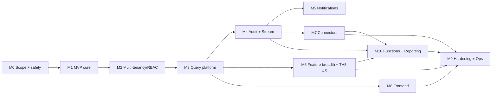

# TheHive 4 Rewrite — Phased Roadmap & Effort Sizing

> Sequences the parity checklist in [`thehive4-parity-spec.md`](./thehive4-parity-spec.md)
> into buildable milestones. Effort is **relative T-shirt sizing** (rough
> person-weeks for a small senior team), not a quote — it exists to show where the
> mass and risk concentrate.
>
> Sizing key: **S** ≈ 1–2 wk · **M** ≈ 2–4 wk · **L** ≈ 1–2 mo · **XL** ≈ 2–4 mo.

## Assumptions baked into the estimates

- **Stack: PostgreSQL + OpenSearch + Row-Level Security** (the recommendation
  from the parity spec). Choosing JanusGraph instead trades the hand-written
  query API for re-implementing the graph-ORM — roughly a wash on total effort,
  worse on operational complexity.
- **One clean v1 API** (not v0+v1 compatibility). Add ~M if you need existing
  TheHive clients to work unchanged.
- **Not a byte-for-byte clone.** Preserve tenant isolation, audit consistency,
  analyst workflows, and connector mutation semantics; treat WebDAV/TheHiveFS,
  exact ScalliGraph query syntax, and v0 compatibility as opt-in work.
- Team already knows the chosen language/framework.

---

## Milestone 0 — Compatibility & safety decisions

Goal: decide what is intentionally compatible, simplified, or dropped before
schema/API work bakes in the wrong assumptions.

| Item | Size | Notes |
|---|---|---|
| Rewrite scope matrix | **S** | keep/simplify/drop decisions for v0/v1 API, TheHiveFS/WebDAV, storage providers, exact query grammar |
| Import/migration spike | **M** | source IDs, case-number continuity, org/share reconstruction, attachments, audits, reindex plan |
| RLS policy matrix + adversarial test plan | **M** | cases/tasks/logs/observables/alerts/audits/dashboards/connectors/exports |
| `/query` grammar decision + golden fixtures | **S** | exact TheHive JSON vs clean grammar with equivalent field-registry semantics |
| Audit/outbox prototype | **S** | mutation + audit + outbox row committed atomically, no publish on rollback |

**Exit:** compatibility decisions are explicit and the highest-risk mechanisms
have testable acceptance criteria. ~**3-5 weeks**.

---

## Milestone 1 — MVP "single-team case tracker" (tenancy schema from day one)

Goal: a single org can create cases/tasks/observables/alerts via API. Proves the
spine end-to-end while using the same org/membership/share/RLS shape that will
serve multi-org deployments. The product can expose only one org at first; the
database model should not be retrofitted later.

| Item | Size | Notes |
|---|---|---|
| Foundation: schema/migrations, entity metadata, config, logging | **M** | Flyway/Liquibase/Alembic; `_created*/_updated*` on every row |
| Auth: session + local (pw + lockout) + API key | **M** | `AuthContext{user, org, perms}` from day one even if single-org |
| Org / Profile / Permission / membership seed model | **S** | minimal admin/org-admin/analyst/read-only |
| Owner Share row + baseline RLS for core records | **M** | every case/task/log/observable row is already scoped through org/share |
| Core entities + CRUD: Case, Task, Log, Observable, Alert | **L** | services + REST controllers |
| Attachments: local FS provider, hash dedup, up/download | **S** | metadata in DB, bytes on disk |
| Thin field registry + basic list/filter/sort | **M** | do not hand-roll throwaway filters; grow this into M3 |
| **Risk to retire:** prove the request pipeline (auth → validate → tx → service → JSON) | — | this is the shape everything else copies |

**Exit:** create→enrich-by-hand→close a case through the API. ~**2–3 months**.

---

## Milestone 2 — Multi-tenancy & RBAC (the correctness milestone)

Goal: many orgs, sharing, airtight isolation. **Do this before building breadth**
— retrofitting tenancy is the classic way clones leak data.

| Item | Size | Notes |
|---|---|---|
| Complete Org / Profile / Permission / membership model | **M** | per-org `User→Profile`, admin-scope permissions |
| **Share model** (case→tasks/observables, owner vs shared, profiles) | **L** | the engine; get the semantics exact |
| Share lifecycle | **M** | share/unshare case, task, observable; `ShareTask.actionRequired`; orphan child cleanup |
| Org-to-org links (who may share with whom) | **S** | |
| **Visibility enforced on every query** (Postgres RLS keyed on share/membership) | **L** | airtight-by-default across joins, aggregations, exports, streams |
| Wire `visible`/`can` equivalents into all M1 services | **M** | retrofit the core entities |

**Exit:** Org A cannot see Org B's data under any query; sharing works. ~**2 months**. **Highest risk in the whole project.**

---

## Milestone 3 — The generic API platform

Goal: the `/query` engine + the field registry that the whole UI depends on.

| Item | Size | Notes |
|---|---|---|
| `PublicProperties`-style field registry per entity | **L** | linchpin abstraction; filter/sort/update/describe all derive from it |
| Generic `/query` pipeline (list→filter→sort→page→aggregation) | **XL** | the single biggest hidden component; type-check or grammar |
| Correct TheHive-style operators or documented replacement grammar | **M** | include `_is/_lte/_gte/_endsWith/_wildcard/_id/_any`; `_contains` means exists |
| Aggregations (count/sum/avg/min/max/time-series/multi-group-by) | **L** | feeds dashboards |
| `/describe` introspection endpoint | **S** | so the UI can auto-build search forms |
| Streamed list responses + total-count header | **S** | |
| **OpenAPI spec** generation for the API *(TheHive 5)* | **S** | cheap, high value; drives client SDKs + the search builder |

**Exit:** UI can be built entirely on `/query` + `describe`. ~**2.5–3.5 months**.

---

## Milestone 4 — Audit, live stream & background

Goal: activity trail + real-time UI refresh + data hygiene.

| Item | Size | Notes |
|---|---|---|
| Audit trail (deferred main-action batching, **publish on commit**) | **L** | bind events to tx outcome, not the service call |
| Durable outbox dispatcher | **M** | stream/notification fan-out with retry/idempotency; replacement for graph tx listener |
| Activity flow (query over main-action audits) | **S** | |
| Live stream (per-session, long-poll, **2nd visibility gate**) | **L** | or SSE/websockets if you prefer |
| Integrity/dedup background jobs | **M** | less critical on SQL than on a graph, but still useful |

**Exit:** every mutation is audited and pushed to the right users live. ~**2 months**.

---

## Milestone 5 — Notifications

| Item | Size | Notes |
|---|---|---|
| Trigger engine (CaseCreated, AlertCreated, TaskAssigned, JobFinished, LogInMyTask, CaseShared, AnyEvent, FilteredEvent) | **M** | subscribes to the commit fan-out from M4 |
| Notifiers (Emailer, Webhook, Mattermost, AppendToFile) | **M** | per-user/per-org config + templating |
| Notifiers: Slack, MS Teams, generic HTTP request *(TheHive 5)* | **S** | parity with TH5 notifier set; see [`thehive5-feature-gap.md`](./thehive5-feature-gap.md) |
| Notifiers: Kafka, Redis (stream/queue sinks) *(TheHive 5)* | **S** | publish events to a bus for SOAR pipelines |

**Exit:** events reach email/webhook/chat. ~**1–1.5 months**.

---

## Milestone 6 — Threat-intel feature breadth

| Item | Size | Notes |
|---|---|---|
| Custom fields (typed values, mandatory, ordering) | **M** | polymorphic value table |
| Case & task templates | **M** | |
| Tags + taxonomies (MISP taxonomy import) | **M** | |
| MITRE ATT&CK (pattern import + hierarchy + procedures) | **M** | |
| Dashboards (definition + aggregation widgets; private vs shared, ~8 widget types) | **M** | depends on M3 aggregations |
| KB pages, observable types, TLP/PAP enforcement everywhere | **S** | |
| **Case Timeline** view *(TheHive 5)* | **S–M** | visual case lifecycle; derive from audit/activity events (M4) |
| **Metrics / KPIs** *(TheHive 5)* | **M** | numeric per-template metrics, distinct from custom fields; feed dashboards/reports |
| **Comments** on cases & alerts *(TheHive 5)* | **S** | TH4 only had task logs |
| **Custom case/alert statuses** *(TheHive 5)* | **S** | per-org status lookup beyond built-in enums |
| **Alert pre-processing** *(TheHive 5)* | **M** | run analyzers on alert observables, add comments/TTPs/KPIs before promotion; alert preview |
| **Observable dedup on import** + Similar alerts / Similar cases tabs *(TheHive 5)* | **M** | dedup on alert import; merged alerts drop out of similarity, the case stays in |

**Exit:** feature-complete for analysts. ~**3.5 months** (parallelizable). TH5-era
items sourced from [`thehive5-feature-gap.md`](./thehive5-feature-gap.md).

---

## Milestone 7 — Connectors

| Item | Size | Notes |
|---|---|---|
| **Cortex** connector: client/auth, analyzer jobs, responder actions, **ActionOperations** (mutate back), report templates, polling | **L** | see [`cortex.md`](./cortex.md) |
| **MISP** connector: scheduled pull, event→alert import, attribute mapping, **export back to MISP**, taxonomy sync | **L** | |
| Connector mutation contract tests | **M** | every connector write goes through services, audit/outbox, RLS, and TLP/PAP checks |

**Exit:** enrichment + intel sharing work. ~**2.5–3 months**.

---

## Milestone 8 — Frontend (parallelizable from end of M3)

| Item | Size | Notes |
|---|---|---|
| SPA: case/alert/observable/task views + live refresh | **XL** | start once M3 API is stable |
| Dashboards & charts | **L** | |
| Admin (orgs/users/profiles/custom fields/templates/taxonomies) | **L** | |
| Search builder (driven by `/query` + `describe`) | **M** | |
| Cortex/MISP UX, file upload, MFA enrollment | **M** | |

**Exit:** usable web app. ~**4–5 months** (overlaps M4–M7).

---

## Milestone 9 — Hardening & ops

| Item | Size | Notes |
|---|---|---|
| MFA/TOTP, LDAP/AD, OAuth2/OIDC, PKI, header SSO, **SAML** *(TheHive 5)* | **L** | each provider is ~S, but there are several |
| **Session management** (list/revoke), **self-service password reset**, **LDAP/AD directory sync** *(TheHive 5)* | **M** | beyond TH4's auth-only LDAP |
| HA / clustering (replicas, distributed pub-sub for stream) | **L** | |
| Health/metrics, packaging (deb/rpm/docker), backup/restore | **M** | |
| Production import tooling from existing TheHive data | **M–L** | builds on M0 spike; only required for real migration |

**Exit:** production-ready. ~**2.5–3 months**.

---

## Milestone 10 — Automation engine & reporting (TheHive 5 parity)

Goal: close the largest competitive gap vs the commercial TheHive 5 — the
**Functions** automation engine — plus case reporting. All net-new in TH5; see
[`thehive5-feature-gap.md`](./thehive5-feature-gap.md). None of this is on the
serial spine; it parallelizes after M4/M6/M7.

| Item | Size | Notes |
|---|---|---|
| **Functions** runtime — sandboxed execution with an objects SDK (read/mutate cases/alerts/tasks/observables) | **L** | runs as a **scoped service identity**, through the same service → audit → outbox → RLS path as connectors |
| Function **triggers**: scheduled (cron), event (`FilteredEvent` etc.), manual-from-case/alert, API/HTTP | **M** | reuses the M4/M5 trigger fan-out + M7 connector-invocation path |
| Functions can invoke Cortex analyzers/responders + outbound HTTP | **S** | depends on M7 |
| **Function security**: scoped principal (not the triggering user's full rights), egress pinning (SSRF), full audit of function-initiated mutations | **M** | scriptable+outbound = privilege-escalation/SSRF surface |
| **Case Reporting** — report-template library → Markdown / printable-HTML with dynamic widgets (text/image/table/list) pulling case data | **M** | TH5 gates this behind Platinum; **Implement-later** unless reporting is an early ask |
| **External Portal / external sharing** *(TheHive 5)* | **M** | share a case to external stakeholders via a constrained portal; external share class + `External-Reader`/`External-Actor` profiles |

**Exit:** analysts can automate workflows and generate case reports. ~**2.5–3.5 months** (parallel).

---

## Critical path & parallelism

- **Serial spine:** M0 → M1 → M2 → M3 → M4. Nothing about correctness or the UI works
  until these are done in order.
- **Fan-out after M3/M4:** feature breadth (M6), connectors (M7), the
  frontend (M8), and the automation engine (M10) can run in parallel with
  separate people.
- **Auth providers, HA, packaging (M9)** can start early but only *finish* at the
  end.
- **TheHive 5 parity** (M10 + the TH5-tagged rows in M3/M5/M6/M9) is breadth, not
  spine — it extends the calendar but not the critical path.

## Where the risk and mass actually are

1. **M3 `/query` engine** (XL) — biggest single component; the UI can't ship without it.
2. **M2 Share visibility** (L, highest *risk*) — a miss is a cross-tenant data leak; mitigate with RLS.
3. **M8 Frontend** (XL aggregate) — easy to underestimate; the live-stream wiring is the fiddly part.
4. **M3 field registry** (L) — get it right and filter/sort/update/describe fall out; skip it and you hand-write filtering forever.
5. **M7 connectors** — lots of edge cases in ActionOperations and MISP mapping.

## Rough total

Calendar: **~13–19 months** for OSS-TheHive-4 parity with a small senior team,
dominated by the serial spine (M0–M4 ≈ 9–11 months) before breadth parallelizes.
A **useful internal MVP** (M0–M2 + thin slice of M3 + a minimal UI) is reachable
in **~6–7 months**.

Reaching **TheHive 5 (commercial) parity** adds roughly **+3–4 months** of
*parallelizable* work (M10 + the TH5-tagged rows) — chiefly the **Functions**
automation engine — pushing full-feature parity toward **~16–22 months** without
moving the critical path. See [`thehive5-feature-gap.md`](./thehive5-feature-gap.md)
for the full delta and per-feature Implement/Defer/Skip calls.
